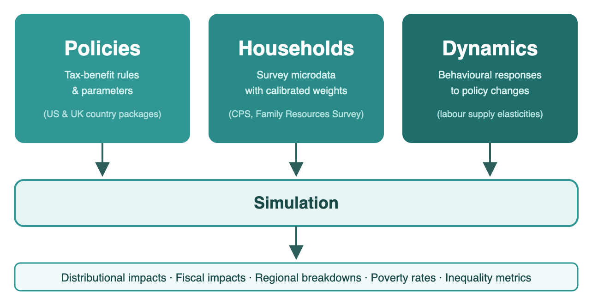

# Summary

The `policyengine` Python package [@policyengine_py] is an open-source analysis layer for tax-benefit microsimulation. The package provides a unified interface for running policy simulations, analyzing distributional impacts, and visualizing results across the US and the UK. It delegates country-specific tax-benefit calculations to dedicated country packages (policyengine-us and policyengine-uk) while providing shared abstractions for simulations, datasets, parametric reforms, and output analysis. The framework supports both individual household simulations and population-wide microsimulations using representative survey microdata with calibrated weights. These workflows also power an interactive web application at [policyengine.org](https://policyengine.org) that enables non-technical users to explore policy reforms in both countries.

# Statement of Need

Tax-benefit microsimulation models are essential tools for evaluating the distributional impacts of fiscal policy. Governments, think tanks, and researchers rely on such models to estimate how policy reforms affect household incomes, poverty rates, and government budgets. In practice, however, analysts often work across fragmented layers: statutory rules, representative microdata, reform definitions, and distributional outputs are managed in different tools and with different interfaces. Reproducing a baseline-versus-reform workflow, or carrying the same analysis pattern from one country model to another, therefore often requires bespoke scripts and project-specific conventions.

The `policyengine` package addresses these gaps by providing an open-source analyst layer that works across multiple country models under a consistent API. Users can supply their own microdata or use companion representative datasets, and compute the impact of current law or hypothetical reforms, including parametric changes to existing policy parameters and structural modifications to the tax-benefit system, on any household or a national population. The Simulation class supports individual household analysis, while population-level aggregate analysis uses representative survey datasets with calibrated weights. The framework's open development on GitHub enables external validation, community contributions, and reproducible policy analysis across countries.

# State of the Field

Tax-benefit microsimulation, pioneered by Orcutt [-@orcutt1957] and surveyed by Bourguignon and Spadaro [-@bourguignon2006], underpins much of modern fiscal policy evaluation. In the US, TAXSIM [@taxsim] at the National Bureau of Economic Research provides tax calculations, while the Congressional Budget Office and Tax Policy Center maintain microsimulation tax models [@cbo2018taxmodel; @tpc2022taxmodel]. In the UK, the primary microsimulation models include UKMOD, maintained by the Institute for Social and Economic Research (ISER), University of Essex, as part of the EUROMOD family [@sutherland2014euromod; @euromod_download_2026], HM Treasury's Intra-Governmental Tax and Benefit Microsimulation model (IGOTM) [@hmt2025igotm], and TAXBEN, maintained by the Institute for Fiscal Studies [@waters2017taxben]. OpenFisca [@openfisca] pioneered the open-source approach to tax-benefit microsimulation in France. Other open-source efforts include the Policy Simulation Library, a collection of policy models and data-preparation routines [@psl2026], and The Budget Lab's public US tax-model codebases, including Tax-Simulator and Cost-Recovery-Simulator [@budgetlab_taxsim_2024; @budgetlab_costrecovery_2025]. PolicyEngine originated from OpenFisca and builds on this foundation through the PolicyEngine Core framework [@policyengine_core].

The country packages already support direct microsimulation analysis and one-off weighted calculations. The `policyengine` package was introduced for a different need: a reusable analyst-facing layer for workflows that recur across projects and countries. In practice, these include harmonized dataset management, a stable baseline-versus-reform pattern, structured output types for distributional and regional analysis, and interfaces suitable for downstream dashboards and reports. Concretely, the package contributes reusable outputs such as `Aggregate`, `ChangeAggregate`, and `IntraDecileImpact`, together with bundled reform analyses such as `economic_impact_analysis()`. This design lets country model packages focus on statutory rules while shared analysis methods evolve independently.

Several practical differences motivate a separate analyst layer:

| Dimension | `policyengine` | TAXSIM | UKMOD | OpenFisca |
|---|---|---|---|---|
| Open source | Yes | Partial | Yes | Yes |
| Main supported workflow | US and UK | US | UK | France, with additional country packages and forks |
| Tax and benefit analysis | Yes | Tax only | Yes | Yes |
| Distributed as a native Python package | Yes | No | No | No |
| Shared analyst-facing reform and output workflow across supported countries | Yes | No | No | Country-specific |

Compared with these tools, `policyengine`'s contribution is not a new legislative engine for a single country. It is a shared analysis layer that sits above country models and makes repeated reform-analysis workflows portable across supported countries. The project also separates reusable engine logic into PolicyEngine Core, analyst workflows into `policyengine`, country legislation into policyengine-us and policyengine-uk, and enhanced survey microdata into companion repositories [@policyengine_core; @woodruff2024enhanced_cps]. This separation allows each layer to be versioned and updated independently as legislation, methodology, and microdata change.

# Software Design

The broader PolicyEngine software stack is built as a four-layer system. PolicyEngine Core provides reusable simulation abstractions, versioned parameters, and dataset interfaces shared across countries [@policyengine_core]. The policyengine-us and policyengine-uk packages contain statutory logic, variables, and entity structures specific to each tax-benefit system. The `policyengine` package sits above them as the analysis layer: it defines shared simulation orchestration, structured output types, and canonical baseline-versus-reform workflows such as `economic_impact_analysis()`. Companion data repositories hold enhanced survey microdata derived from the CPS [@woodruff2024enhanced_cps] and Family Resources Survey [@frs2020]. Figure 1 illustrates this architecture.

{width="100%"}

This split reflects a deliberate trade-off. The project could have kept analysis code inside each country package or inside downstream application repositories, but that would duplicate methodology and make cross-country work harder to keep aligned. By extracting repeated analyst tasks into `policyengine`, the project centralizes distributional methods while leaving legislative implementation in the country packages. The cost is added package coordination and a clearer interface boundary across repositories.

As shown in Figure 1, at runtime a simulation combines a country model version, household microdata, and optional reform or dynamic-response inputs. The same layer then exposes reusable outputs for decile changes, program statistics, poverty, inequality, and regional impacts, which are consumed by examples, research scripts, and the public web application.

The `policyengine` package does not include an underlying macroeconomic model in its microsimulation analysis and does not capture general equilibrium effects.

# Research Impact Statement

PolicyEngine has demonstrated research impact across government, academia, and policy research in both the US and the UK.

**Government adoption.** HM Treasury has formally documented PolicyEngine in the UK Algorithmic Transparency Recording Standard, describing it as a model their Personal Tax, Welfare and Pensions team is exploring for "advising policymakers on the impact of tax and welfare measures on households" [@hmt2024atrs].

**Congressional and parliamentary citation.** In the US, Representatives Morgan McGarvey and Bonnie Watson Coleman cited PolicyEngine's analysis in introducing the Young Adult Tax Credit Act (H.R.7547), stating that "according to the model at PolicyEngine, 22% of all Americans would see an increase in their household income under this program, and it would lift over 4 million Americans out of poverty" [@mcgarvey2024yatc]. In the UK, Baroness Altmann referenced PolicyEngine and its interactive dashboard during House of Lords Grand Committee debate on the National Insurance Contributions (Employer Pensions Contributions) Bill in February 2026, noting that Commons Library research using PolicyEngine provided "a useful picture of the distributional effects of raising the contribution limit" across income deciles [@hansard2026nic].

**Institutional use and validation.** The Federal Reserve Bank of Atlanta independently validates PolicyEngine's model through its Policy Rules Database, conducting three-way comparisons between PolicyEngine, TAXSIM, and the Fed's own models [@atlanta_fed_prd]. Co-author Max Ghenis and Jason DeBacker (University of South Carolina) presented the Enhanced Current Population Survey methodology at the 117th Annual Conference on Taxation of the National Tax Association [@ghenis2024nta].

**Academic research.** The Better Government Lab, a joint center of the Georgetown McCourt School of Public Policy and the University of Michigan Ford School of Public Policy, collaborated with PolicyEngine on benefits eligibility research [@pe_bgl]. Matt Unrath (University of Southern California) is using PolicyEngine in a study of effective marginal and average tax rates facing American families, funded by the US Department of Health and Human Services through the Institute for Research on Poverty [@pe_usc]. The Beeck Center at Georgetown University featured PolicyEngine in research on rules-as-code for US public benefits [@beeck2023rac; @beeck2025ai]. Youngman et al. [-@youngman2026carbon] cite PolicyEngine UK's microdata methodology in their agent-based macroeconomic model for the UK's Seventh Carbon Budget at the Institute for New Economic Thinking, Oxford.

**Policy research.** In the US, the Niskanen Center used PolicyEngine to estimate the cost and distributional impacts of Child Tax Credit reform options [@mccabe2024ctc]. DC Councilmember Zachary Parker cited PolicyEngine's analysis when introducing the District Child Tax Credit Amendment Act of 2023, the first local child tax credit in US history [@pe_dctc]. Senator Cory Booker's office embedded a PolicyEngine-built calculator on his official Senate website for the Keep Your Pay Act [@pe_keepyourpay]. In the UK, the National Institute of Economic and Social Research (NIESR) used PolicyEngine in their UK Living Standards Review 2025 [@niesr2025living], and the Institute of Economic Affairs has published PolicyEngine-based analyses of employer National Insurance contributions and 2025–2026 tax changes [@woodruff2024nic; @woodruff2025tax].

# Acknowledgements

This work was supported in the US by Arnold Ventures [@arnold_ventures], NEO Philanthropy [@neo_philanthropy], the Gerald Huff Fund for Humanity, and the National Science Foundation (NSF POSE Phase I, Award 2518372) [@nsf_pose], and in the UK by the Nuffield Foundation since September 2024 [@nuffield2024grant]. These funders had no involvement in the design, development, or content of this software or paper.

We acknowledge contributions from all PolicyEngine contributors, and thank the OpenFisca community for the foundational microsimulation framework [@openfisca]. We acknowledge the US Census Bureau for providing access to the Current Population Survey, and the UK Data Service and the Department for Work and Pensions for providing access to the Family Resources Survey.

# AI Usage Disclosure

Generative AI tools, specifically Claude Opus 4 by Anthropic [@claude2026], were used to assist with code refactoring. All AI-assisted outputs were reviewed, edited, and validated by human authors, who made all core design decisions regarding software architecture, policy modeling, and parameter implementation. The authors remain fully responsible for the accuracy, originality, and correctness of all submitted materials.

# References
